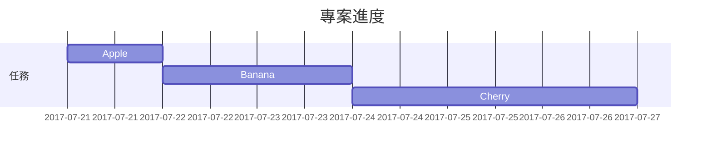

# 文字與排版展示

發布日期：2019年8月8日
更新日期：2024年7月2日
作者：Cotes Chung
閱讀時間：3 分鐘

---

## 標題範例

# H1 — heading
## H2 — heading
### H3 — heading
#### H4 — heading

---

## 段落展示

Quisque egestas convallis ipsum, ut sollicitudin risus tincidunt a. Maecenas interdum malesuada egestas. Duis consectetur porta risus, sit amet vulputate urna facilisis ac. Phasellus semper dui non purus ultrices sodales. Aliquam ante lorem, ornare a feugiat ac, finibus nec mauris. Vivamus ut tristique nisi. Sed vel leo vulputate, efficitur risus non, posuere mi. Nullam tincidunt bibendum rutrum. Proin commodo ornare sapien. Vivamus interdum diam sed sapien blandit, sit amet aliquam risus mattis. Nullam arcu turpis, mollis quis laoreet at, placerat id nibh. Suspendisse venenatis eros eros.

---

## 列表展示

### 有序列表
1. 首先
2. 第二點
3. 第三點

### 無序列表
- 章節
- 單元
- 段落

### 待辦事項
- [ ] 工作
- [ ] 步驟 1
- [ ] 步驟 2
- [ ] 步驟 3

### 說明列表
- **太陽**：地球繞行的恆星
- **月亮**：地球的天然衛星，由反射的太陽光可見

---

## 區塊引用

> 這行展示了區塊引用（Block Quote）的格式效果。

---

## 提示框類型

> 💡 這是提示類型範例
> ℹ️ 這是資訊類型範例
> ⚠️ 這是警告類型範例
> ❗ 這是危險類型範例

---

## 表格展示

| 公司名稱 | 聯絡人         | 國家   |
|----------|----------------|--------|
| Alfreds Futterkiste | Maria Anders     | 德國   |
| Island Trading       | Helen Bennett    | 英國   |
| Magazzini Alimentari Riuniti | Giovanni Rovelli | 義大利 |

---

## 鏈接

[本機端範例網址](http://127.0.0.1:4000)

---

## 註腳示例

點擊會跳轉到註腳[^1]，這裡是另一個註腳[^2]。

[^1]: 第1個註腳說明
[^2]: 第2個註腳說明

---

## 程式碼與路徑

### 內嵌程式碼
`這是一個內嵌程式碼的範例`

### 檔案路徑
`/path/to/the/file.extend`

### 程式碼區塊
一般程式碼：
```
這是一段沒有語法標示的程式碼。
```

Bash 指令：
```bash
if [ $? -ne 0 ]; then
  echo "The command was not successful.";
  # do the needful / exit
fi;
```

SASS 樣式：
```scss
@import
  "colors/light-typography",
  "colors/dark-typography";
```

---

## 數學公式

當 \( ax^2 + bx + c = 0 \)，其解為：

\[
x = \frac{-b \pm \sqrt{b^2 - 4ac}}{2a}
\]

---

## 圖表與甘特圖（Mermaid）



---

## 圖片展示

- 預設（含標題）
- 全螢幕寬度置中顯示
- 左對齊圖片
- 左浮動圖文排版
- 右浮動圖文排版

---

## 暗／亮模式與陰影圖片

圖片會根據網站主題自動切換，並具有陰影效果。

---

## 影片嵌入

此區支援影片播放功能。

---

## 反向註腳

[^1]: 第1個註腳來源 ↩︎
[^2]: 第2個註腳來源 ↩︎

---

## 標籤

- #Blogging
- #Demo
- #Typography

---

## 授權資訊

本文採用 [CC BY 4.0](https://creativecommons.org/licenses/by/4.0/) 授權，允許在標註作者的情況下使用與修改。
